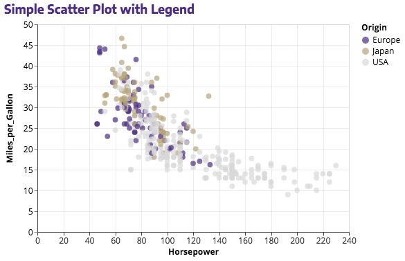
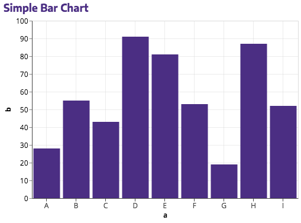
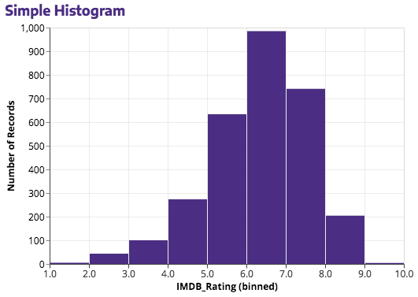
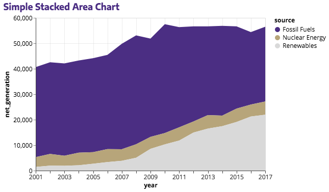
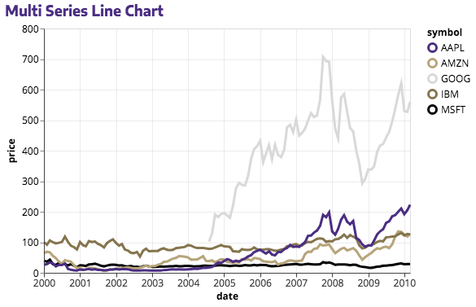
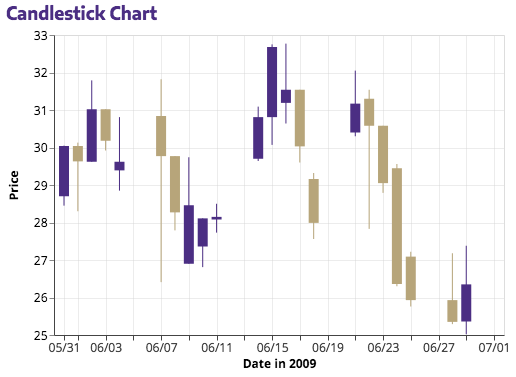

# `husky_theme` for Altair

This repo defines `husky_theme`, a theme for Altair charts based on the [University of Washington branding guidelines](http://www.washington.edu/brand/graphic-elements/). That said, it is NOT an official product of the University of Washington.

The theme was built with inspiration from Sergio Sánchez's excellent blog post: [Consistently Beautiful Visualizations with Altair Themes](https://towardsdatascience.com/consistently-beautiful-visualizations-with-altair-themes-c7f9f889602).

If you use the theme, [I'd love to hear about it](deppen.8@gmail.com).

## Usage

1. Obviously, you will need `altair`.
2. This theme uses three fonts:
    - Encode Sans - Regular
    - Open Sans - Regular
    - Open Sans - Bold

  If you don't have these installed, all three fonts are all available via Google Fonts. You can get them from within a Jupyter Notebook with:

```python
%%html
<style>
@import url('https://fonts.googleapis.com/css?family=Encode+Sans:400');
@import url('https://fonts.googleapis.com/css?family=Open+Sans:400');
@import url('https://fonts.googleapis.com/css?family=Open+Sans:700');
</style>
```

3. Since the theme is defined in a `.py` file, you can register and enable it in Jupyter Notebook with the following magic:

```python
%run husky_theme.py
```

## Examples

Below are a few examples using the `husky_theme` to reproduce examples from the [Altair Example Gallery](https://altair-viz.github.io/gallery/index.html).

(The `husky_theme.ipynb` notebook contains a more complete series of examples. In a few cases, I have slightly altered the code from the Altair docs. These are noted along with the example.)













## Contributing

I welcome contributions/improvements to the theme. Feel free to submit a PR.